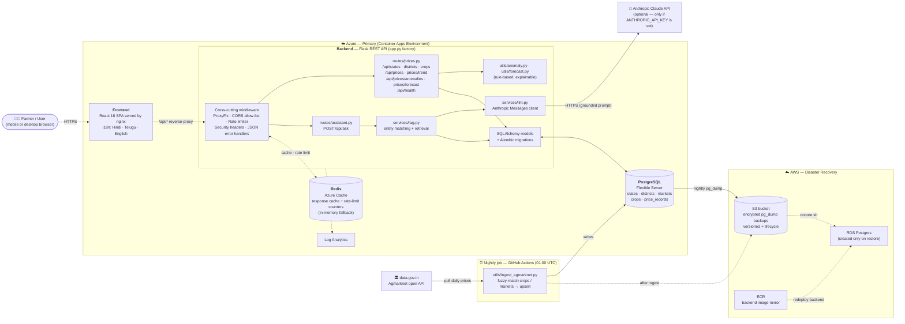
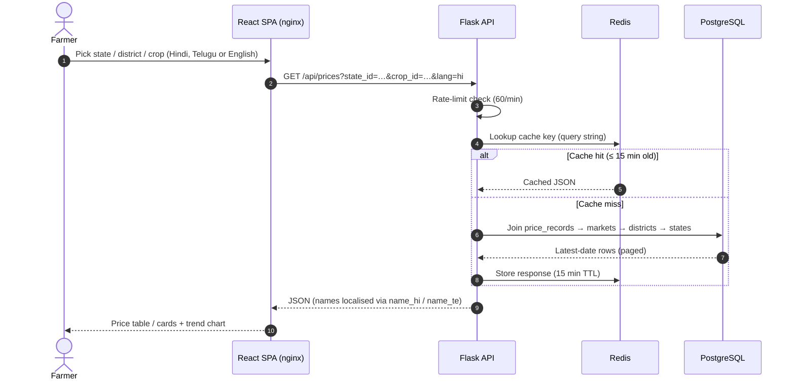
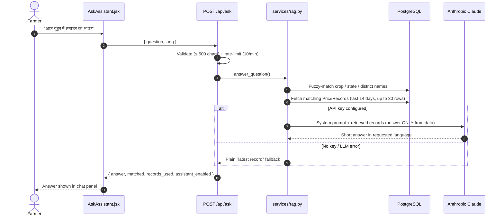
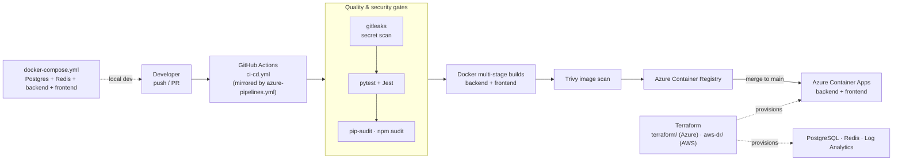
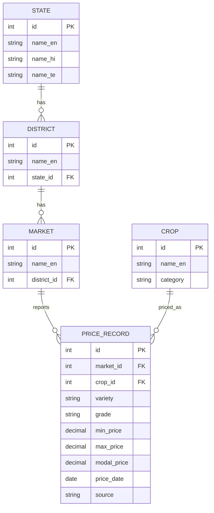

# Mandi Bhav — Crop Price & Mandi Transparency Platform

## Stack

| Layer | Choice |
|---|---|
| Frontend | React (React 18, react-i18next for Hindi/Telugu/English) |
| Backend | Python Flask (REST API) |
| Database | PostgreSQL |
| Cache | Redis (caches price lookups, ~15 min TTL) |
| Containerization | Docker (multi-stage builds) |
| IaC | Terraform (Azure primary, AWS for DR) |
| Cloud | Azure (Container Apps, PostgreSQL Flexible Server, Azure Cache for Redis, ACR) |
| Disaster Recovery | AWS (S3 nightly `pg_dump` backups + RDS/ECS restore runbook) |
| DevOps | GitHub Actions (CI/CD, scheduled ingestion) + an equivalent Azure DevOps pipeline |

## Architecture

### High-level overview

### Request flow — price lookup (cached read path)

### Request flow — AI assistant (grounded RAG)

### Delivery pipeline & environments

### Data model

### Components

- **Frontend (`frontend/`)** — a React single-page app served by nginx.
  Handles language switching (Hindi/Telugu/English), filters, the price
  table, and trend charts. Talks to the backend only through `/api/*`,
  which nginx reverse-proxies to the Flask service.
- **Backend (`backend/`)** — a Flask REST API (`app.py` as the application
  factory) exposing endpoints for states/districts/crops/prices, price
  trends, anomaly detection, short-term forecasting, and the `/api/ask`
  assistant. Cross-cutting concerns (CORS, rate limiting, security
  headers, proxy trust) are configured centrally in `extensions.py` and
  `config.py`.
- **Database** — PostgreSQL, accessed via SQLAlchemy models
  (`models.py`), with schema changes managed through Flask-Migrate
  (Alembic) rather than ad-hoc DDL.
- **Cache / rate limiting** — Redis backs both the response cache
  (`flask-caching`) and the request-rate limiter (`flask-limiter`), with
  an automatic in-memory fallback if Redis is unreachable so the API
  degrades gracefully instead of failing outright.
- **Ingestion job (`backend/utils/ingest_agmarknet.py`)** — pulls crop
  price data from the official data.gov.in API mirror of Agmarknet on a
  schedule and loads it into Postgres, fuzzy-matching crop/market names
  against existing records.
- **AI assistant (`backend/services/rag.py`, `services/llm.py`)** — a
  lightweight retrieval-augmented endpoint: it matches crop/state/district
  names mentioned in a question against the DB, retrieves the relevant
  recent price records, and asks an LLM to answer strictly from that data.
  Falls back to a plain "latest record" response when no LLM key is
  configured.
- **Anomaly & forecast utilities (`backend/utils/anomaly.py`,
  `forecast.py`)** — rule-based deviation-from-trailing-average and
  least-squares trend calculations (not ML models), used by the
  anomalies and forecast endpoints.

### Infrastructure & deployment

- **Primary (Azure)** — provisioned via Terraform (`terraform/`):
  Resource Group, Azure Container Registry, PostgreSQL Flexible Server,
  Azure Cache for Redis, a Log Analytics workspace, and a Container Apps
  Environment running the backend and frontend containers.
- **CI/CD** — GitHub Actions (`.github/workflows/ci-cd.yml`, mirrored by
  `azure-pipelines.yml` for Azure DevOps shops) runs a secret scan,
  backend/frontend tests and dependency/vulnerability scans, builds and
  pushes Docker images to ACR, scans images for vulnerabilities, and
  deploys to Container Apps on merge to `main`.
- **Scheduled jobs** — a separate workflow
  (`.github/workflows/ingest-and-backup.yml`) runs nightly to pull fresh
  price data and back up the database.
- **Disaster recovery (AWS)** — a cost-conscious "backup + redeploy"
  pattern (`aws-dr/`): nightly encrypted `pg_dump` backups pushed to an
  S3 bucket, with a documented `restore.sh` runbook that stands up an RDS
  Postgres instance and redeploys the backend (mirrored to ECR) if Azure
  becomes unreachable.
- **Local development** — `docker-compose.yml` runs the full stack
  (Postgres, Redis, backend, frontend) locally in one command.

## Security

### Secrets management

- No credentials are hardcoded in application code. Local secrets are
  supplied via a `.env` file (gitignored, based on `.env.example`); in
  CI/CD and production they come from GitHub Actions secrets and
  Container App secrets.
- `SECRET_KEY` fails loudly at startup in production if it isn't set,
  rather than silently falling back to a default value — the app refuses
  to boot instead of running insecurely.
- The `ANTHROPIC_API_KEY` and `DATA_GOV_IN_API_KEY` are optional at
  runtime: their absence disables the related feature (AI assistant /
  live ingestion) instead of crashing the app.

### Application-layer protections

- **CORS** is restricted to an explicit allow-list (`CORS_ORIGINS`)
  rather than `*`.
- **Rate limiting** (`flask-limiter`) protects the public API from
  scraping/abuse, backed by Redis with an in-memory fallback so limiting
  stays active even during a Redis outage.
- **Security headers** are set on every response: `X-Content-Type-Options`,
  `X-Frame-Options`, `Referrer-Policy`, a restrictive
  `Content-Security-Policy`, and `Strict-Transport-Security` in
  non-debug mode.
- The app trusts exactly one reverse-proxy hop (`ProxyFix`), so
  rate-limiting and logging see the real client IP rather than the
  proxy's.

### CI/CD security checks

- Every push/PR runs a **secret-scanning** job (gitleaks) before any
  build or deploy step.
- **Dependency vulnerability scans** run on both backend (`pip-audit`)
  and frontend (`npm audit`) dependencies.
- **Container image scanning** (Trivy) checks built images for known
  CVEs before deployment.

### Data protection

- DR backups to S3 are server-side encrypted (SSE-AES256) and lifecycle
  managed (old versions expire automatically).
- Redis connections in production use TLS (`rediss://`).
- Database credentials and connection strings are injected as Container
  App secrets, not stored in Terraform state as plain variables or
  committed to the repo.

### Known hardening follow-ups

These need real cloud account access to do safely and aren't implemented
in this repo yet:

- Move DB/Redis connection strings out of Terraform-interpolated
  Container App secrets and into Azure Key Vault references.
- Restrict the Postgres flexible server firewall rule (currently open to
  any Azure tenant) to a VNet/private endpoint.
- Switch ACR auth from admin username/password to managed identity.
- Replace the long-lived `AZURE_CREDENTIALS` / AWS access-key GitHub
  secrets with OIDC federated login for both clouds.
- Put a WAF / Azure Front Door in front of the public Container App
  ingress.
- Encrypt DR backups with a customer-managed KMS key instead of relying
  solely on S3's default SSE-S3.

## Why this application is different from other applications

Most mandi/crop-price tools fall into one of two buckets: an official
government portal that's data-complete but hard to use, or a scraper-based
third-party app that's easier to use but built on fragile, unofficial data
collection. This project is designed to sit in neither bucket.

- **Sourced from the official API, not scraped.** Agmarknet's own website
  is notoriously difficult to query programmatically. Instead of scraping
  HTML (which breaks on every markup change and is a legal/ToS grey area),
  `backend/utils/ingest_agmarknet.py` pulls from the official data.gov.in
  API mirror of the same dataset — a stable, sanctioned, structured data
  source. Most third-party price apps take the scraping shortcut; this one
  deliberately doesn't.

- **Built for the farmer reading it, not just the data.** The UI defaults
  to **Hindi**, not English, with Telugu also supported and more languages
  addable by extending one resources object (`frontend/src/i18n`). Most
  agricultural data portals — government and private alike — are
  English-first with regional language support as an afterthought, if it
  exists at all. This flips that default.

- **Mobile-first for low-bandwidth users.** Large touch targets, a price
  table that collapses into cards on narrow screens, and a minimal JS
  bundle — built on the assumption that the target user is on a mid-range
  Android phone on a patchy mobile connection, not a desktop browser on
  fiber.

- **Explains *why* a price looks unusual, instead of just listing it.**
  The `/api/prices/anomalies` endpoint flags prices that deviate sharply
  from a market's trailing 7-day average — the kind of signal that helps a
  farmer spot when a middleman is quoting a suspiciously low price. Plain
  price-listing apps show the number; this one also flags when the number
  looks wrong.

- **An AI assistant that's grounded, not generative.** `/api/ask` doesn't
  let an LLM freely answer price questions from its own "knowledge" (which
  would risk confidently inventing a price). It retrieves the actual
  matching `PriceRecord`s from the database first, and instructs the model
  to answer *only* from that retrieved data — a deliberate RAG design
  rather than a chatbot bolted on for its own sake. It also degrades
  gracefully: with no API key configured, the endpoint still returns a
  plain "latest record" answer instead of failing.

- **Deviation-based and trend-based, not black-box ML — on purpose.** Both
  anomaly detection and price forecasting use transparent, explainable
  methods (trailing-average deviation; least-squares trend fitting)
  instead of an opaque ML model. At this data volume, a rule a farmer or
  developer can actually read and verify is more trustworthy than a model
  that's marginally more accurate but impossible to explain — see the
  docstrings in `backend/utils/anomaly.py` and `forecast.py`.

- **Resilient by design, not just by scale.** Redis-backed caching and
  rate limiting both fall back to in-memory alternatives automatically if
  Redis is unreachable, so a cache outage degrades performance rather than
  taking the whole API down — a distinction many small-to-mid apps skip.

- **Honest, right-sized disaster recovery.** Rather than marketing
  always-on multi-cloud redundancy it doesn't need, this project is
  explicit about its actual DR posture: nightly encrypted backups to AWS
  S3 plus a documented, scripted restore runbook, with a stated RPO of
  ~24h and RTO of ~1-2h. That's a deliberate cost/benefit call for a
  public-good transparency site, stated plainly instead of oversold.

- **Security treated as a default, not an add-on.** Secret scanning,
  dependency and container image scanning run on every CI build; the app
  fails to start in production without a real `SECRET_KEY` instead of
  silently using an insecure default; and standard hardening (CORS
  allow-list, security headers, rate limiting) ships out of the box
  rather than being left for a "someday" security pass. See the
  Security section above.

